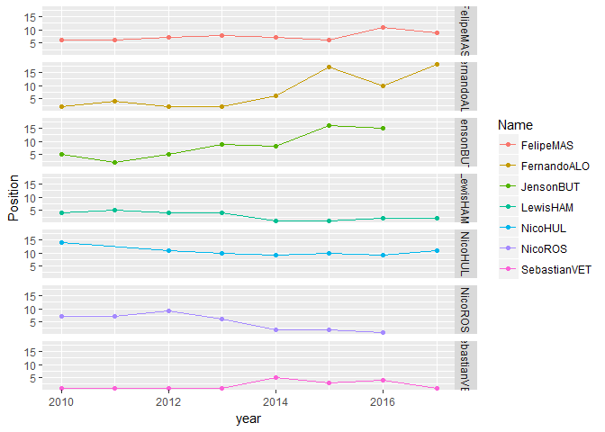
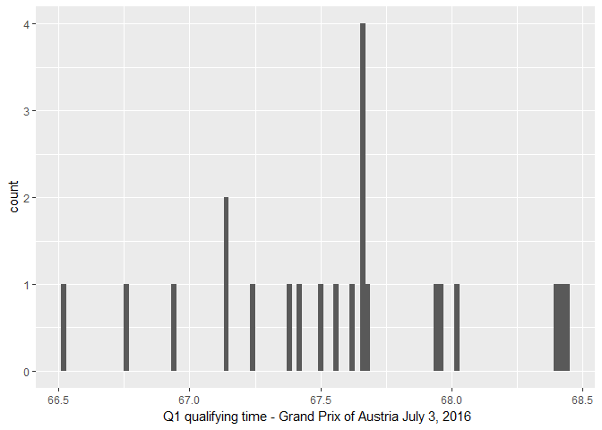

Sporting and Data Analytics: An Exploration into Formula One
================
Yun Mai
April 22, 2017

Motivation
----------

I choose Formula One as the topic of the final project because I want to understand how to entertain a data driven sport and to learn how this industry work. To me, the most fascinated part of this sport is its technical aspect as it represents both the advanced automobile and aeronautical engineering. While Formula One could be seen as automobile companies showcasing their ability to perform in racing sport, it brings the fast evolution of the technologies behind the sport. The racing telemetry collect data like the speed, stability, tire wear, and aerodynamics etc. combined with data analytics allows engineers to evaluate the performance of cars around the racing track and figure out what needs to change. The audience could anticipate the enhanced engineering by each passing season. Therefore data is the trade secret for each team because whether teams can shave hundredths of seconds off their lap times will rely on the details of those data. Another reason I like to investigate Formula One is that it is a game of number. For example, 1.5 GB of data will generate for each car per race for McLaren. Each weekend the Grand Prix racing results broadcast on TV so that audience can follow the race and be updated. More data including practice laps, warming up are available at Formula One Live Timing. So there are plenty of data for me to do interesting analysis in this sport.

Goal
----

The goal of this project is to apply R language and MySQL I've learned in Data Acquisition and Management Course to collect, structure and visualize data in the context of Formula One sporting. At the same time, I hope I can learn the history of this sport and learn how this industry works through digging the data of racing results. Formula One rule becomes more and more complicated in the regulation of the costs, safety. Thought this gives the dedicated fans more fun, it makes it difficult to someone who is new to this sport to enjoy it right away. To knowing how technical and sporting regulations shape this sport, I will extract the information from the archive and find out quantification analysis.

Data Science Workflow
---------------------

To obtain the goal, I will use OSEMN model. That is, I will execute a data science workflow that includes:

Obtaining data Scrubbing data Exploring data Modeling data iNterpreting data

**1.Obtaining data**

Data were collected from the following data source:

1.Ergast Developer API (ergast.com/mrd/)

2.FIA archive from 2012 to 2016 (<http://www.fia.com/f1-archives>) and the current year data in this URL: <http://www.fia.com/events/fia-formula-one-world-championship/season-2017/2017-fia-formula-one-world-championship>.

3.Formula1.com archive from 1950-2016 (<https://www.formula1.com/en/results.html/1950/races/94/great-britain/race-result.html>) (Great Britain) and the and the current year data in this URL: <https://www.formula1.com/en/results.html/2017/races/959/australia/fastest-laps.html>

For API, JSON file were downloaded and stored. For PDF, PDFTables(<https://pdftables.com/>) was used to extract data and convert to .xlsx files followed by a convertion to .txt file. R packages "RCurl", "jsonlite", "XML" will be used in downloading data from the websites.

Packages as shown in the following used in this projects were loaded.

    ## Warning: package 'RCurl' was built under R version 3.3.3

    ## Loading required package: bitops

    ## Warning: package 'XML' was built under R version 3.3.3

    ## 
    ## Attaching package: 'tidyr'

    ## The following object is masked from 'package:RCurl':
    ## 
    ##     complete

    ## Warning: package 'dplyr' was built under R version 3.3.3

    ## 
    ## Attaching package: 'dplyr'

    ## The following objects are masked from 'package:stats':
    ## 
    ##     filter, lag

    ## The following objects are masked from 'package:base':
    ## 
    ##     intersect, setdiff, setequal, union

    ## Warning: package 'stringr' was built under R version 3.3.3

    ## Warning: package 'ggplot2' was built under R version 3.3.3

**2.Scrubbing data**

The raw data were downloaded from the above mentioned resources. Data tidying and reorganizing were performed to transform the data to a structure that is easy for analysis and modling. For example, some unnecessary variables were removed and some number will be converted to numeric or character type as they would be used as continuous or categorical variables. R packages "stringr", "tidyr", "dplyr", "knitr" were used. "RMySQL" were used in data cleaning, transforming and storage.

**3.Exploring data**

After cleaning the data in hands, basic statistics were done such as viewing the distribution of the data. Mean and standard diviation of some of the data were checked. Some sporting related analysis was also performed. For example, whether there was racer not qualified in the qualifying session was checked.

**4.Modeling data and iNterpreting data**

Overview:

The path to the championship: plot the position changes of each team and driver to see their Chronological performance.

Practice time utilization: to reproduce how each driver uses the track in the practice, the accumulated time derived from the lap time record was calculated and plotted. The stint time (between pit stops) segmentation with the time elapse could be viewd from the plot.

Lap chart: position changes of each driver at each run of qualifying.

Race chart: the gap to the leader of each driver at each lap was ploted to view the relative position change with the time elapse.

Reproduce the fight for the lead: calculate and plot the difference of lap times between to two fighting cars at each lap will give people close look at the battle

Championship: (List of Formula One World Championship points scoring system. from Wikipedia) The total points of 1st and 2nd drivers were calculated and the best performers were defined by theirs points and times won the championship.

``` r
json_url <- "http://ergast.com/api/f1/2016/9/qualifying.json"
jsonFile <- getURL(json_url)
jsonContent <- fromJSON(jsonFile)
json_table5 <- jsonContent$MRData

json_table6 <-json_table5$RaceTable
json_table7 <-json_table6$Races
json_table8 <-json_table7$QualifyingResults
json_table9 <-json_table8[[1]]
json_table10 <-json_table9[["Driver"]]
json_table11 <-json_table9[["Constructor"]]
json_table9$Driver <- NULL
json_table9$Constructor <- NULL
json_table<- cbind(json_table9,json_table10)
json_table <- cbind(json_table,json_table11)
json_table <- json_table[,c("number","position", "Q1", "Q2", "Q3", "driverId","permanentNumber", "code", "url", "givenName", "familyName", "dateOfBirth", "nationality", "constructorId", "url", "name", "nationality")]
json_table$permanentNumber <- NULL
kable(head(json_table,n=5))
```

| number | position | Q1       | Q2       | Q3       | driverId   | code | url                                                 | givenName | familyName | dateOfBirth | nationality | constructorId | url.1                                               | name        | nationality.1 |
|:-------|:---------|:---------|:---------|:---------|:-----------|:-----|:----------------------------------------------------|:----------|:-----------|:------------|:------------|:--------------|:----------------------------------------------------|:------------|:--------------|
| 44     | 1        | 1:06.947 | 1:06.228 | 1:07.922 | hamilton   | HAM  | <http://en.wikipedia.org/wiki/Lewis_Hamilton>       | Lewis     | Hamilton   | 1985-01-07  | British     | mercedes      | <http://en.wikipedia.org/wiki/Lewis_Hamilton>       | Mercedes    | British       |
| 6      | 2        | 1:06.516 | 1:06.403 | 1:08.465 | rosberg    | ROS  | <http://en.wikipedia.org/wiki/Nico_Rosberg>         | Nico      | Rosberg    | 1985-06-27  | German      | mercedes      | <http://en.wikipedia.org/wiki/Nico_Rosberg>         | Mercedes    | German        |
| 27     | 3        | 1:07.385 | 1:07.257 | 1:09.285 | hulkenberg | HUL  | <http://en.wikipedia.org/wiki/Nico_H%C3%BClkenberg> | Nico      | Hülkenberg | 1987-08-19  | German      | force\_india  | <http://en.wikipedia.org/wiki/Nico_H%C3%BClkenberg> | Force India | German        |
| 5      | 4        | 1:06.761 | 1:06.602 | 1:09.781 | vettel     | VET  | <http://en.wikipedia.org/wiki/Sebastian_Vettel>     | Sebastian | Vettel     | 1987-07-03  | German      | ferrari       | <http://en.wikipedia.org/wiki/Sebastian_Vettel>     | Ferrari     | German        |
| 22     | 5        | 1:07.653 | 1:07.572 | 1:09.900 | button     | BUT  | <http://en.wikipedia.org/wiki/Jenson_Button>        | Jenson    | Button     | 1980-01-19  | British     | mclaren       | <http://en.wikipedia.org/wiki/Jenson_Button>        | McLaren     | British       |

``` r
#convert qualifying time Q1 time to seconds and annotated as "ctime"
json_table$Q1m <- as.numeric(str_extract(json_table$Q1,"\\d+"))

json_table$Q1s <- str_extract(json_table$Q1,":\\d+.")
json_table$Q1s <- as.numeric(str_extract(json_table$Q1s,"\\d+"))

json_table$Q1ms <- str_extract(json_table$Q1, "\\.\\d+")
json_table$Q1ms <- as.numeric(str_extract(json_table$Q1ms,"\\d+")) 
  
json_table$Q1ctime <- json_table$Q1m * 60 + json_table$Q1s +(json_table$Q1ms)/1000

#convert qualifying time Q2 time to seconds and annotated as "ctime"
json_table$Q2m <- as.numeric(str_extract(json_table$Q2,"\\d+"))

json_table$Q2s <- str_extract(json_table$Q2,":\\d+.")
json_table$Q2s <- as.numeric(str_extract(json_table$Q2s,"\\d+"))

json_table$Q2ms <- str_extract(json_table$Q2, "\\.\\d+")
json_table$Q2ms <- as.numeric(str_extract(json_table$Q2ms,"\\d+")) 
  
json_table$Q2ctime <- json_table$Q2m * 60 + json_table$Q2s +(json_table$Q2ms)/1000

#convert qualifying time Q3 time to seconds and annotated as "ctime"
json_table$Q3m <- as.numeric(str_extract(json_table$Q3,"\\d+"))

json_table$Q3s <- str_extract(json_table$Q3,":\\d+.")
json_table$Q3s <- as.numeric(str_extract(json_table$Q3s,"\\d+"))

json_table$Q3ms <- str_extract(json_table$Q3, "\\.\\d+")
json_table$Q3ms <- as.numeric(str_extract(json_table$Q3ms,"\\d+")) 
  
json_table$Q3ctime <- json_table$Q3m * 60 + json_table$Q3s +(json_table$Q3ms)/1000
```

``` r
ggplot(json_table,aes(Q1ctime))+
  geom_histogram(binwidth = 0.02)+
  labs(x=" Q1 qualifying time - Grand Prix of Austria July 3, 2016")
```


Normal distribution of the fast laptime is not anticipated in the F1 qualifying session.

**107% rule:** The 107% rule is a sporting regulation affecting Formula One racing qualifying sessions. During the first phase of qualifying, any driver who fails to set a lap within 107 percent of the fastest time in the first qualifying session will not be allowed to start the race.

``` r
q <-min(json_table$Q1ctime)*1.07
qualifying.failed <- json_table[which(json_table$Q1ctime > q),]
paste("There is/are",nrow(qualifying.failed),"racer who faild in 107% rule in 2016 Season Run 9 (Grand Prix of Austria - July 3, 2016).")
```

    ## [1] "There is/are 0 racer who faild in 107% rule in 2016 Season Run 9 (Grand Prix of Austria - July 3, 2016)."

Path to the champion - Team
---------------------------

The Constructors Championship was not awarded until 1958. So data from 1950 till now will be collected.

``` r
# The process will be very slow while kniting the R Markdown file. So I commended the following code and save the data but the evaluation will be silenced.

finalTable <- data.frame()
htmlTable <- data.frame()
for (i in 1958:2017){
  html_url <- paste0("https://www.formula1.com/en/results.html/",i,"/team.html")
  fetch_html <- getURL(html_url)
  htmlContent <- htmlParse(fetch_html,encoding = "UTF-8")
  htmlTable <- readHTMLTable(htmlContent, stringsAsFactors = FALSE)
  Sys.sleep(0.5)
  htmlTable <- htmlTable[[1]]
  htmlTable$year <- rep(i,nrow(htmlTable))
  finalTable <- rbind(finalTable,htmlTable)
}

colnames(finalTable) <- c("Empty1","Pos","Team","Pts","Empty2","year")
finalTable$Empty1 <-NULL
finalTable$Empty2 <-NULL

finalTable$Pos <- as.numeric(finalTable$Pos)

write.csv(finalTable,"F1_team.csv")
```

``` r
# F1_team.csv were uploaded to the Github repo and then downloaded.

finalTable <- read.csv(file="https://raw.githubusercontent.com/YunMai-SPS/DA607/master/DA607_final%20project/F1_team.csv", header=TRUE, sep=",", stringsAsFactors = F)

tally <- as.data.frame(table(finalTable$Team))
team1 <- tally[which(tally$Freq == 1),]
team2 <- tally[which(tally$Freq == 2),]
team3 <- tally[which(tally$Freq == 3),]
team4 <- tally[which(tally$Freq == 4),]
team5 <- tally[which(tally$Freq == 5),]
team6 <- tally[which(tally$Freq == 6),]
team7 <- tally[which(tally$Freq == 7),]
team8 <- tally[which(tally$Freq == 8),]
team9 <- tally[which(tally$Freq == 9),]
team10 <- tally[which(tally$Freq == 10),]
teamLong <- as.data.frame(tally[which(tally$Freq != 1 & tally$Freq != 2 & tally$Freq != 3 & tally$Freq != 4 & tally$Freq != 5 & tally$Freq != 6 & tally$Freq != 7 & tally$Freq != 8 & tally$Freq != 9), ])

longlastTeam.name <- as.character(teamLong$Var1)

longlastTeam <- finalTable[which(finalTable$Team == longlastTeam.name[1] | finalTable$Team == longlastTeam.name[2] | finalTable$Team == longlastTeam.name[3] | finalTable$Team == longlastTeam.name[4] | finalTable$Team == longlastTeam.name[5] | finalTable$Team == longlastTeam.name[6] | finalTable$Team == longlastTeam.name[7] | finalTable$Team == longlastTeam.name[8] | finalTable$Team == longlastTeam.name[9]),]

longlastTeam <- group_by(longlastTeam,Team)
    
ggplot(data = longlastTeam, aes(x=year, y=Pos, color = Team, group = Team)) +
    geom_point() +
    geom_line() +
    facet_grid(Team ~ .)
```



Path to the champion - Driver
-----------------------------

``` r
# The process will be held while kniting the R Markdown file. So I commended the following code and save the data but the evaluation will be silenced.

driverTable <- data.frame()
htmlTable <- data.frame()
for (i in 1950:2017){
  html_url <- paste0("https://www.formula1.com/en/results.html/",i,"/drivers/94/great-britain/race-result.html")
  fetch_html <- getURL(html_url)
  htmlContent <- htmlParse(fetch_html,encoding = "UTF-8")
  htmlTable <- readHTMLTable(htmlContent, stringsAsFactors = FALSE)
  Sys.sleep(0.5)
  htmlTable <- htmlTable[[1]]
  htmlTable$year <- rep(i,nrow(htmlTable))
  driverTable <- rbind(driverTable,htmlTable)
}
  
colnames(driverTable) <- c("Empty1","Pos","Driver","Nationality","Car","Pts","Empty2","year")

driverTable$Empty1 <-NULL
driverTable$Empty2 <-NULL

driverTable$Pos <- as.numeric(driverTable$Pos)

write.csv(driverTable,"F1_driver.csv")
```

``` r
# F1_driver.csv were uploaded to the Github repo and then downloaded.

driverTable <- read.csv(file="https://raw.githubusercontent.com/YunMai-SPS/DA607/master/DA607_final%20project/F1_driver.csv", header=TRUE, sep=",", stringsAsFactors = F)

driverTable50 <- driverTable[which(driverTable$year < 1960),]
driverTable60 <- driverTable[which(driverTable$year >= 1960 & driverTable$year < 1970),]
driverTable70 <- driverTable[which(driverTable$year >= 1970 & driverTable$year < 1980),]
driverTable80 <- driverTable[which(driverTable$year >= 1980 & driverTable$year < 1990),]
driverTable90 <- driverTable[which(driverTable$year >= 1990 & driverTable$year < 2000),]
driverTable00 <- driverTable[which(driverTable$year >= 2000 & driverTable$year < 2010),]
driverTable10 <- driverTable[which(driverTable$year >= 2010 & driverTable$year < 2020),]

driverTable50$Driver<- str_replace_all(driverTable50$Driver,"[:space:]?\n[:space:]+", " ")
driverTable50$FirstName <- str_extract(driverTable50$Driver, "[:alpha:]+")
driverTable50$LastName <- str_extract(driverTable50$Driver, "[A-Z]{3}\\b")
driverTable50 <- transform(driverTable50, Name = paste(FirstName,LastName, sep = ""))

drivertally50 <- as.data.frame(table(driverTable50$Name))
colnames(drivertally50) <- c("Name","Freq")
d50.1 <- drivertally50[which(drivertally50$Freq == max(drivertally50$Freq)),]
d50.2 <- drivertally50[which(drivertally50$Freq == (max(drivertally50$Freq)-1)),]
d50.3 <- drivertally50[which(drivertally50$Freq == (max(drivertally50$Freq)-2)),]
d50.top3.tally <- rbind(d50.1,d50.2,d50.3)

sort(d50.top3.tally$Freq, decreasing = T)  
```

    ## [1] 8 7 7 6 6 6 6 6

``` r
d50.top3.name <- as.character(d50.top3.tally$Name)

length(d50.top3.name)
```

    ## [1] 8

``` r
driverTable50$Name <-as.character(driverTable50$Name)

d50.top3 <- driverTable50[which(driverTable50$Name == d50.top3.name[1] | driverTable50$Name == d50.top3.name[2] | driverTable50$Name == d50.top3.name[3] | driverTable50$Name == d50.top3.name[4] | driverTable50$Name == d50.top3.name[5] | driverTable50$Name == d50.top3.name[6] | driverTable50$Name == d50.top3.name[7] | driverTable50$Name == d50.top3.name[8]),]

d50.top3 <- group_by(d50.top3,Name)
 
ggplot(data = d50.top3, aes(x=year, y=Pos, color = Name, group = Name)) +
    geom_point() +
    geom_line() +
    facet_grid(Name ~ .)
```


**Get familiar with the 90', 00' and 10' racers**

``` r
driverTable10$Driver <-str_replace_all(driverTable10$Driver,"[:space:]?\n[:space:]+", " ")
driverTable10$FirstName <- str_extract(driverTable10$Driver, "[:alpha:]+")
driverTable10$LastName <- str_extract(driverTable10$Driver, "[A-Z]{3}\\b")
driverTable10 <- transform(driverTable10, Name = paste(FirstName,LastName, sep = ""))

drivertally10 <- as.data.frame(table(driverTable10$Name))
colnames(drivertally10) <- c("Name","Freq")
d10.1 <- drivertally10[which(drivertally50$Freq == max(drivertally10$Freq)),]
d10.2 <- drivertally10[which(drivertally50$Freq == (max(drivertally10$Freq)-1)),]
d10.3 <- drivertally10[which(drivertally50$Freq == (max(drivertally10$Freq)-2)),]
d10.top3.tally <- rbind(d10.1,d10.2,d10.3)

sort(d10.top3.tally$Freq, decreasing = T)  
```

    ## [1] 7 3 2

``` r
d10.top3.name <- as.character(d10.top3.tally$Name)

length(d10.top3.name)
```

    ## [1] 8

``` r
driverTable10$Name <-as.character(driverTable10$Name)

d10.top3 <- driverTable50[which(driverTable50$Name == d50.top3.name[1] | driverTable50$Name == d50.top3.name[2] | driverTable50$Name == d50.top3.name[3] | driverTable50$Name == d50.top3.name[4] | driverTable50$Name == d50.top3.name[5] | driverTable50$Name == d50.top3.name[6] | driverTable50$Name == d50.top3.name[7] | driverTable50$Name == d50.top3.name[8]),]

d50.top3 <- group_by(d50.top3,Name)
 
ggplot(data = d50.top3, aes(x=year, y=Pos, color = Name, group = Name)) +
    geom_point() +
    geom_line() +
    facet_grid(Name ~ .)
```


Practice and Qulifying
----------------------

**Since 2006, three practice sessions are held before the Grand Prix race; the first on Friday morning and the second on Friday afternoon(Thursday at Monaco). Both sessions last one and a half hours. While individual practice sessions are not compulsory, a driver must take part in at least one practice session to be eligible for the race. Teams use practise time to work on car set-upin preparation for qualifying and the race.**

``` r
# Grand Prix of Austrlia, July 2016, First Practice: AuJy.p1

# timing sheet contents in PDF from FIA were extract through https://pdftables.com/ and converted to a tab-delimited text file. Hunderdth second can make the difference to the race results. The crucial data, milisecond, in three desimal place could be preserved in a tab-delimited text file.

AuJy.p1 <- read.table("https://raw.githubusercontent.com/YunMai-SPS/DA607/master/DA607_final%20project/practice_lap_times_55_raw%20-%20Copy.txt",fill = TRUE)
colnames(AuJy.p1) <- c("lapNo","pit","time","No","Name","V6","V7")
AuJy.p1 <- AuJy.p1[-1, ]
AuJy.p1.fix <- AuJy.p1[AuJy.p1$pit == "P",]
AuJy.p1.fix$pit <- NULL
AuJy.p1.fix$V6 <- paste(AuJy.p1.fix$V6,AuJy.p1.fix$V7)
AuJy.p1.fix$V7 <- NULL

colnames(AuJy.p1.fix) <- c("lapNo","pit","time","No","Name")

AuJy.p1.fix$pit <- str_replace(AuJy.p1.fix$pit, "11","1")

AuJy.p1.rest <- AuJy.p1[AuJy.p1$pit != "P",]
AuJy.p1.rest$V7 <- NULL
AuJy.p1.rest$Name <- paste(AuJy.p1.rest$Name,AuJy.p1.rest$V6)
AuJy.p1.rest$V6 <- NULL
AuJy.p1 <- rbind(AuJy.p1.fix,AuJy.p1.rest)

AuJy.p1$lapNo <- as.character(AuJy.p1$lapNo)
AuJy.p1$lapNo <- str_extract(AuJy.p1$lapNo,"\\d+")
AuJy.p1$lapNo <- as.numeric(AuJy.p1$lapNo)

AuJy.p1$No <- as.numeric(AuJy.p1$No)
AuJy.p1$time <- as.character(AuJy.p1$time)
AuJy.p1 <-arrange(AuJy.p1,No,lapNo)

# find out the driver who first recorded a laptime during the session
start.time <- AuJy.p1[which(AuJy.p1$lapNo == 1),]
start.time$hour <- str_extract(start.time$time,"\\d+")
start.time$hour <- as.numeric(start.time$hour)

start.time$minute <- str_extract(start.time$time,":\\d+:")
start.time$minute <- str_replace_all(start.time$minute,":","")
start.time$minute <- as.numeric(start.time$minute)

start.time$second <- as.numeric(str_sub(start.time$time, -2,-1))

earliest.start <- start.time[which(start.time$hour == min(start.time$hour)),]

if (nrow(earliest.start) == 1){
  basetime <- earliest.start$hour * 60 * 60 + earliest.start$minute * 60 + earliest.start$second
}else
{
  earliest.start <- earliest.start[which(earliest.start$minute == min(earliest.start$minute)),]
}

if (nrow(earliest.start) == 1){
  basetime <- earliest.start$hour * 60 * 60 + earliest.start$minute * 60 + earliest.start$second
}else
{
  earliest.start <- earliest.start[which(earliest.start$second == min(earliest.start$second)),]
  basetime <- earliest.start$hour * 60 * 60 + earliest.start$minute * 60 + earliest.start$second
}

# set basetime as the  time recorded by the driver who first recorded the laptime. It is converted to seconds.

# First laptime in AuJy.p1 is special as it is not laptime but the time of day the driver completed their first lap of the session. So calculate the first 'laptime' and the other laptime separately.

#calculate the first 'laptime'
#convert time to secondsand annotated as  "ctime". Set basetime as 0.
start.time$ctime <- start.time$hour*60*60+ start.time$minute*60+ start.time$second
start.time$ctime <- start.time$ctime-basetime

#remove first 'laptime' from the dataset and calculte the other laptime.
intermediate <- AuJy.p1[which(AuJy.p1$lapNo != 1),]

#convert time to seconds and annotated as "ctime"
intermediate$minute <- as.numeric(str_extract(intermediate$time,"\\d+"))

intermediate$second <- str_extract(intermediate$time,":\\d+.")
intermediate$second <- str_extract(intermediate$second,"\\d+")
intermediate$second <- as.numeric(intermediate$second)

intermediate$milisecond <- str_extract(intermediate$time, "\\.\\d+")
intermediate$milisecond <- str_extract(intermediate$milisecond,"\\d+")
intermediate$milisecond <- as.numeric(intermediate$milisecond) 
  
intermediate$ctime <- intermediate$minute * 60 + intermediate$second +(intermediate$milisecond)/1000

#attach ctime to the original dataset by combining start.time and intermediate.
start.time$hour <- NULL
start.time$minute <- NULL
start.time$second <- NULL
  
intermediate$minute <- NULL
intermediate$second <- NULL
intermediate$milisecond <- NULL

AuJy.p1 <- rbind(start.time,intermediate)

AuJy.p1 <- arrange(AuJy.p1,No,lapNo)

#calculate the cumulated time
AuJy.p1 <- AuJy.p1 %>% 
  group_by(No) %>% 
  mutate(cumtime = cumsum(ctime))

kable(head(AuJy.p1,n=5))
```

|  lapNo| pit | time      |   No| Name    |     ctime|   cumtime|
|------:|:----|:----------|----:|:--------|---------:|---------:|
|      1| 1   | 10:01:54  |    1| F. NASR |    14.000|    14.000|
|      2| 0   | 18:59.955 |    1| F. NASR |  1139.955|  1153.955|
|      3| 0   | 1:13.592  |    1| F. NASR |    73.592|  1227.547|
|      4| 0   | 1:12.738  |    1| F. NASR |    72.738|  1300.285|
|      5| 0   | 1:11.766  |    1| F. NASR |    71.766|  1372.051|

``` r
ggplot(data = AuJy.p1, aes(x=cumtime, y=Name, color = Name, group = Name)) +
    geom_point() +
    geom_line() +
    geom_point(data=AuJy.p1[which(AuJy.p1$pit == 1), ], aes(x=cumtime, y=Name),color="black",pch = 1,size = 1.7)
```


``` r
AuJy.qli <- read.table("https://raw.githubusercontent.com/YunMai-SPS/DA607/master/DA607_final%20project/qulifying_lap_time_58_raw.txt",fill=T,row.names=NULL)

colnames(AuJy.qli) <- c("lapNo","pit","time","No","FN","LN")
AuJy.qli$Name <- paste(AuJy.qli$FN,AuJy.qli$LN)
AuJy.qli$FN <- NULL
AuJy.qli$LN <- NULL

AuJy.qli$time <- as.character(AuJy.qli$time)

# find out the driver who first recorded a laptime during the session
start.time.qli <-AuJy.qli[which(AuJy.qli$lapNo == 1),]
start.time.qli$hour <- str_extract(start.time.qli$time,"\\d+")
start.time.qli$hour <- as.numeric(start.time.qli$hour)

start.time.qli$minute <- str_extract(start.time.qli$time,":\\d+:")
start.time.qli$minute <- str_replace_all(start.time.qli$minute,":","")
start.time.qli$minute <- as.numeric(start.time.qli$minute)

start.time.qli$second <- as.numeric(str_sub(start.time.qli$time, -2,-1))

earliest.start.qli <- start.time.qli[which(start.time.qli$hour == min(start.time.qli$hour)),]

if (nrow(earliest.start.qli) == 1){
  basetime.qli <- earliest.start.qli$hour * 60 * 60 + earliest.start.qli$minute * 60 + earliest.start$second.qli
}else
{
  earliest.start.qli <- earliest.start.qli[which(earliest.start.qli$minute == min(earliest.start.qli$minute)),]
}

if (nrow(earliest.start.qli) == 1){
  basetime/qli <- earliest.start.qli$hour * 60 * 60 + earliest.start.qli$minute * 60 + earliest.start.qli$second
}else
{
  earliest.start.qli <- earliest.start.qli[which(earliest.start.qli$second == min(earliest.start.qli$second)),]
  basetime.qli <- earliest.start.qli$hour * 60 * 60 + earliest.start.qli$minute * 60 + earliest.start.qli$second
}

# set basetime as the  time recorded by the driver who first recorded the laptime. It is converted to seconds.

# First laptime in AuJy.p1 is special as it is not laptime but the time of day the driver completed their first lap of the session. So calculate the first 'laptime' and the other laptime separately.

#calculate the first 'laptime'
#convert time to secondsand annotated as  "ctime". Set basetime as 0.
start.time.qli$ctime <- start.time.qli$hour*60*60+ start.time.qli$minute*60+ start.time.qli$second
start.time.qli$ctime <- start.time.qli$ctime-basetime.qli

#remove first 'laptime' from the dataset and calculte the other laptime.
intermediate.qli <- AuJy.qli[which(AuJy.qli$lapNo != 1),]

#convert time to seconds and annotated as "ctime"
intermediate.qli$minute <- as.numeric(str_extract(intermediate.qli$time,"\\d+"))

intermediate.qli$second <- str_extract(intermediate.qli$time,":\\d+.")
intermediate.qli$second <- str_extract(intermediate.qli$second,"\\d+")
intermediate.qli$second <- as.numeric(intermediate.qli$second)

intermediate.qli$milisecond <- str_extract(intermediate.qli$time, "\\.\\d+")
intermediate.qli$milisecond <- str_extract(intermediate.qli$milisecond,"\\d+")
intermediate.qli$milisecond <- as.numeric(intermediate.qli$milisecond) 
  
intermediate.qli$ctime <- intermediate.qli$minute * 60 + intermediate.qli$second +(intermediate.qli$milisecond)/1000

#attach ctime to the original dataset by combining start.time and intermediate.
start.time.qli$hour <- NULL
start.time.qli$minute <- NULL
start.time.qli$second <- NULL
  
intermediate.qli$minute <- NULL
intermediate.qli$second <- NULL
intermediate.qli$milisecond <- NULL

AuJy.qli <- rbind(start.time.qli,intermediate.qli)

AuJy.qli$lapNo <- as.numeric(AuJy.qli$lapNo)
AuJy.qli <- arrange(AuJy.qli,No,lapNo)

#calculate the cumulated time
AuJy.qli <- AuJy.qli %>% 
  group_by(No) %>% 
  mutate(cumtime = cumsum(ctime))

kable(head(AuJy.qli,n=5))
```

|  lapNo|  pit| time     |   No| Name         |    ctime|  cumtime|
|------:|----:|:---------|----:|:-------------|--------:|--------:|
|      1|    0| 14:10:35 |    3| D. RICCIARDO |  525.000|  525.000|
|      2|    0| 1:07.824 |    3| D. RICCIARDO |   67.824|  592.824|
|      3|    0| 1:24.580 |    3| D. RICCIARDO |   84.580|  677.404|
|      4|    0| 1:07.500 |    3| D. RICCIARDO |   67.500|  744.904|
|      5|    1| 1:25.712 |    3| D. RICCIARDO |   85.712|  830.616|

``` r
ggplot(data = AuJy.qli, aes(x=cumtime, y=Name, color = Name, group = Name)) +
    geom_point() +
    geom_line() +
    geom_point(data=AuJy.qli[which(AuJy.qli$pit == 1), ], aes(x=cumtime, y=Name),color="black",pch = 1,size = 1.7)
```



"There was a unanimous move to the pits, but a couple of drivers were caught in the worst of the weather, per Formula One: Here comes the rain... ??? It's already caught out Perez and Palmer \#FP2 \#AustrianGP" (RORY MARSDEN, Austrian F1 Grand Prix 2016 Qualifying: Results, Times from Friday's Practice, BleacherReport, JULY 1, 2016)

Race chart
----------

``` r
AuJy.race <- read.csv("https://raw.githubusercontent.com/YunMai-SPS/DA607/master/DA607_final%20project/history_chart_11_australiaJuly2016.csv")
AuJy.race <- AuJy.race [,1:4]
kable(head(AuJy.race,n=3))
```

|  lapNo|   No| gap   | time     |
|------:|----:|:------|:---------|
|      1|   44| 0     | 1:15.725 |
|      1|   22| 0.664 | 1:16.389 |
|      1|    7| 1.312 | 1:17.037 |

``` r
#change class of variable from factor to character for further manipulation
AuJy.race$gap <- as.character(AuJy.race$gap)
AuJy.race$time <- as.character(AuJy.race$time)
AuJy.race$minute <-as.numeric(str_extract(AuJy.race$time,"\\d+"))
AuJy.race$second <-str_extract(AuJy.race$time,":\\d+")
AuJy.race$second <-as.numeric(str_extract(AuJy.race$second,"\\d+"))
AuJy.race$milisecond <-as.numeric(str_sub(AuJy.race$time,-3,-1))
AuJy.race$timeinsecond <- AuJy.race$minute*60 + AuJy.race$second + (AuJy.race$milisecond)/1000

AuJy.race <- AuJy.race %>% 
  group_by(No) %>% 
  mutate(cumtime=cumsum(timeinsecond))


# add the laptime of fastest racer in the lap to the laptime of racer who is one lap behind  
find.behind <- subset(AuJy.race, gap == "1 LAP")

find.lap <- levels(as.factor(find.behind$lapNo))
find.lap <- as.numeric(find.lap)
print("find.lap contain the lap No. in which there is racer who is more than 1 lap behind the fastest racer:")
```

    ## [1] "find.lap contain the lap No. in which there is racer who is more than 1 lap behind the fastest racer:"

``` r
print(find.lap)
```

    ##  [1] 25 26 27 51 52 53 54 55 56 57 58 59 60 61 62 63 64 65 66 67 68 69 70
    ## [24] 71

``` r
find.leader<- AuJy.race[which(AuJy.race$lapNo == 25 & AuJy.race$gap == "0"),]
lap <- data.frame()
for(i in c(find.lap)){
  lap <- AuJy.race[which(AuJy.race$lapNo == i & AuJy.race$gap == "0"),]
  find.leader<- union(find.leader,lap)
}

leader.behind <- rbind(find.leader,find.behind)

leader.behind <- arrange(leader.behind,lapNo)

single.behind <- spread(leader.behind,gap,cumtime)
names(single.behind)[names(single.behind)=="0"]<- "zero"
names(single.behind)[names(single.behind)=="1 LAP"]<- "onelap"

require(zoo)
```

    ## Loading required package: zoo

    ## 
    ## Attaching package: 'zoo'

    ## The following objects are masked from 'package:base':
    ## 
    ##     as.Date, as.Date.numeric

``` r
single.behind <- transform(single.behind, zero = na.locf(zero))

OneLap <- single.behind[which(is.na(single.behind$onelap) == F),]
OneLap$cumtime <- OneLap$zero + OneLap$onelap

#OneLap$timeinsecond <- OneLap$zero + OneLap$onelap

OneLap <- arrange(OneLap,No,lapNo)

# "1 LAP"" does not mean one more laptime of the fastest racer will be added to the gap. So the following thee sentences are not right and will not be run.
#OneLap <- OneLap %>% 
#  group_by(No) %>% 
#  mutate(cumtime=cumsum(timeinsecond))

OneLap$zero <- NULL
OneLap$onelap <- NULL

#OneLap$timeinsecond <- NULL

#OneLap$cumtime <- NULL

OneLap$gap <- "1 LAP"
OneLap <- OneLap[,c("lapNo","No","gap","time","minute","second","milisecond","timeinsecond","cumtime")]

#names(OneLap)[names(OneLap)=="cumtime"] <- "timeinsecond"
  
removeOneLap <- AuJy.race[which(AuJy.race$gap != "1 LAP"),]

AuJy.race <- union(removeOneLap,OneLap)

AuJy.race <- arrange(AuJy.race,lapNo,timeinsecond)

# rank the racers in each lap
sorted <- AuJy.race %>% 
  group_by(lapNo) %>% 
  mutate(rank=row_number(cumtime)) %>% 
  arrange(lapNo,rank)
sorted$No <- as.character(sorted$No)

ggplot(data = sorted, aes(x=lapNo, y=rank, color = No, group=No)) +
    geom_point() +
    geom_line() 
```


``` r
ggplot(data = subset(sorted,No == 44 | No == 6), aes(x=lapNo, y=rank, color = No, group=No)) +
    geom_point() +
    geom_line() +
    scale_x_continuous(breaks=seq(1,72,4))+
    scale_y_continuous(breaks=c(1,26,1))
```


Here is the strory of competetion between Rosburg (car No. 6) and Hamilton (car No. 44) at the last lap:<http://www.telegraph.co.uk/formula-1/2016/07/03/austrian-grand-prix-2016-f1-live/>.

"Daniel Johnson reports on the post-drama fallout in Austria:Mercedes have slammed the "brainless" last-lap crash in the Austrian Grand Prix which has left Nico Rosberg under investigation by the stewards after he collided with Lewis Hamilton. Hamilton won the race, passing his team-mate on the final lap, but Rosberg broke his front wing and toured round to finish fourth. The gap in the drivers' championship is down to 11 points."

Reproduce the fight for the lead
--------------------------------

``` r
a <- data.frame(sorted)
a <- mutate(a, calgap=0)
k <- 1
n <- 1
for(i in 1:71){
  for(j in 1:nrow(a[which(a$lapNo == i),])){
    if (i==1){
      a[j,11] <- a[j,9] - a[i,9]
      k <- 1+j
    }else{
      a[k,11] <- a[k,9] - a[n,9]
      k <- k+1
      n <- k-j
    }
  }
  n<-n+nrow(a[which(a$lapNo == i),])
} 

a$diff <- a$calgap*(-1)
a$No <- as.character(a$No)

ggplot(data = a, aes(x=lapNo, y=diff, color = No, group=No)) +
    geom_point() +
    geom_line() 
```


``` r
ggplot(data = subset(a,No == 44 | No == 33 | No == 7 | No == 6 | No == 3), aes(x=lapNo, y=diff, color = No, group=No)) +
    geom_point() +
    geom_line() 
```


**Saturday's qualifying session, designed to take about an hour, is split into three distinct segments - Q1, Q2 and Q3.**

**Q1: Lasts for 18 minutes, at the end of which time the six slowest drivers are eliminated from qualifying and 16 advance to Q2.**

**Q2: After a short break, the times are reset and the 16 remaining cars run in a 15-minute session, at the end of which the slowest six are eliminated from qualifying, leaving 10 to progress to Q3. **

**Q3: After a further break, the times are reset and a final 12-minute session is held to decide pole position and the starting order for the top ten grid places.**

``` r
#The 1st of the Championship in 2006

json_url <- "http://ergast.com/api/f1/2006/results/1.json"
jsonFile <- getURL(json_url)
jsonContent <- fromJSON(jsonFile)
json_table5 <- jsonContent$MRData

json_table6 <-json_table5$RaceTable
json_table7 <-json_table6$Races
json_table8 <-json_table7$Results
json_table9 <- data.frame(json_table8[[1]])[,c(1,2,4)]

for( i in 2:18){
  json_table9 <- rbind(json_table9,data.frame(json_table8[[i]])[,c(1,2,4)])
}

json_table10 <- json_table8[[1]][["Driver"]]

for( i in 2:18){
  if (i %in% c(2,4,5,10,11,12,15,16)){
     b <- json_table8[[i]][["Driver"]]
     b$permanentNumber <- NA 
     json_table10 <- rbind(json_table10,b)
  }else{
     c <- json_table8[[i]][["Driver"]]
     json_table10 <- rbind(json_table10,c)
  }
}

json_table11 <- json_table8[[1]][["Constructor"]]
for(i in 2:18){
 json_table11 <- rbind(json_table11,json_table8[[i]][["Constructor"]])
}

json_table12 <- data.frame(json_table8[[1]][["FastestLap"]])[,1:2]
json_table12 <- json_table12[,1:2]
for( i in 2:18){
  json_table12 <- rbind(json_table12,data.frame(json_table8[[i]][["FastestLap"]])[,1:2])
}

json_table13 <- json_table8[[1]][["FastestLap"]]
json_table14 <- json_table13[["AverageSpeed"]]

for( i in 2:18){
     c <- json_table8[[i]][["FastestLap"]]
     d <- c[["AverageSpeed"]]
     json_table14 <- rbind(json_table14,d)
}
json_table15 <- cbind(json_table12,json_table14)

e <- cbind(json_table9,json_table10)
json_table.results <-cbind(e,json_table15)
names(json_table.results)[names(json_table.results) == "driverId"]<-"name"
json_table.results$year<- "2006"
json_table.results <- json_table.results[c("year","number","position", "points" ,"name", "permanentNumber", "code", "url","givenName", "familyName", "dateOfBirth","nationality", "rank", "lap", "units", "speed")]
json_table.results1 <- json_table.results[,c("year","number","position", "points" ,"name", "rank", "lap", "units", "speed")]
kable(head(json_table.results,n=2))
```

| year | number | position | points | name       | permanentNumber | code | url                                                 | givenName | familyName | dateOfBirth | nationality | rank | lap | units | speed   |
|:-----|:-------|:---------|:-------|:-----------|:----------------|:-----|:----------------------------------------------------|:----------|:-----------|:------------|:------------|:-----|:----|:------|:--------|
| 2006 | 1      | 1        | 10     | alonso     | 14              | ALO  | <http://en.wikipedia.org/wiki/Fernando_Alonso>      | Fernando  | Alonso     | 1981-07-29  | Spanish     | 3    | 21  | kph   | 210.551 |
| 2006 | 2      | 1        | 10     | fisichella | NA              | FIS  | <http://en.wikipedia.org/wiki/Giancarlo_Fisichella> | Giancarlo | Fisichella | 1973-01-14  | Italian     | 2    | 16  | kph   | 209.402 |

``` r
#The 2nd of the Championship in 2006

json_url <- "http://ergast.com/api/f1/2006/results/2.json"
jsonFile <- getURL(json_url)
jsonContent <- fromJSON(jsonFile)
json_table5 <- jsonContent$MRData

json_table6 <-json_table5$RaceTable
json_table7 <-json_table6$Races
json_table8 <-json_table7$Results
json_table9 <- data.frame(json_table8[[1]])[,c(1,2,4)]

for( i in 2:18){
  json_table9 <- rbind(json_table9,data.frame(json_table8[[i]])[,c(1,2,4)])
}

json_table10 <- json_table8[[1]][["Driver"]]
json_table10 <- json_table10[["driverId"]]

for( i in 2:18){
     f <- json_table8[[i]][["Driver"]][["driverId"]]
     json_table10 <- rbind(json_table10,f)
}

json_table11 <- json_table8[[1]][["Constructor"]]
for(i in 2:18){
 json_table11 <- rbind(json_table11,json_table8[[i]][["Constructor"]])
}

json_table12 <- data.frame(json_table8[[1]][["FastestLap"]])[,1:2]
json_table12 <- json_table12[,1:2]
for( i in 2:18){
  json_table12 <- rbind(json_table12,data.frame(json_table8[[i]][["FastestLap"]])[,1:2])
}

json_table13 <- json_table8[[1]][["FastestLap"]]
json_table14 <- json_table13[["AverageSpeed"]]

for( i in 2:18){
     c <- json_table8[[i]][["FastestLap"]]
     d <- c[["AverageSpeed"]]
     json_table14 <- rbind(json_table14,d)
}

json_table.results2 <- cbind(json_table9,json_table10,json_table12,json_table14)

names(json_table.results2)[names(json_table.results2) == "json_table10"] <- "name" 
json_table.results2$year<- "2006"

json_table.results2 <- json_table.results2[c("year","number","position", "points" ,"name", "rank", "lap", "units", "speed")]

kable(head(json_table.results2,n=2))
```

| year | number | position | points | name                | rank | lap | units | speed   |
|:-----|:-------|:---------|:-------|:--------------------|:-----|:----|:------|:--------|
| 2006 | 5      | 2        | 8      | michael\_schumacher | 2    | 38  | kph   | 210.576 |
| 2006 | 1      | 2        | 8      | alonso              | 1    | 45  | kph   | 210.487 |

To be concise, the code, similar to above two chunks, for collecting race results from 2007 to 2016 will be hide but the only the data was shown here.
======================================================================================================================================================

| year | number | position | points | name      | rank | lap | units | speed   |
|:-----|:-------|:---------|:-------|:----------|:-----|:----|:------|:--------|
| 2008 | 22     | 1        | 10     | hamilton  | 2    | 39  | kph   | 218.300 |
| 2008 | 1      | 1        | 10     | raikkonen | 2    | 37  | kph   | 209.158 |

| year | number | position | points | name     | rank | lap | units | speed   |
|:-----|:-------|:---------|:-------|:---------|:-----|:----|:------|:--------|
| 2008 | 3      | 2        | 8      | heidfeld | 3    | 41  | kph   | 217.586 |
| 2008 | 4      | 2        | 8      | kubica   | 6    | 39  | kph   | 208.033 |

| year | number | position | points | name   | rank | lap | units | speed   |
|:-----|:-------|:---------|:-------|:-------|:-----|:----|:------|:--------|
| 2010 | 8      | 1        | 25     | alonso | 1    | 45  | kph   | 191.706 |
| 2010 | 1      | 1        | 25     | button | 6    | 52  | kph   | 213.804 |

| year | number | position | points | name   | rank | lap | units | speed   |
|:-----|:-------|:---------|:-------|:-------|:-----|:----|:------|:--------|
| 2010 | 7      | 2        | 18     | massa  | 5    | 38  | kph   | 189.392 |
| 2010 | 11     | 2        | 18     | kubica | 8    | 52  | kph   | 213.138 |

| year | number | position | points | name   | rank | lap | units | speed   |
|:-----|:-------|:---------|:-------|:-------|:-----|:----|:------|:--------|
| 2012 | 3      | 1        | 25     | button | 1    | 56  | kph   | 214.053 |
| 2012 | 5      | 1        | 25     | alonso | 7    | 53  | kph   | 196.250 |

| year | number | position | points | name   | rank | lap | units | speed   |
|:-----|:-------|:---------|:-------|:-------|:-----|:----|:------|:--------|
| 2012 | 1      | 2        | 18     | vettel | 2    | 57  | kph   | 213.503 |
| 2012 | 15     | 2        | 18     | perez  | 3    | 54  | kph   | 197.531 |

| year | number | position | points | name     | rank | lap | units | speed   |
|:-----|:-------|:---------|:-------|:---------|:-----|:----|:------|:--------|
| 2014 | 6      | 1        | 25     | rosberg  | 1    | 19  | kph   | 206.436 |
| 2014 | 44     | 1        | 25     | hamilton | 1    | 53  | kph   | 193.611 |

| year | number | position | points | name             | rank | lap | units | speed   |
|:-----|:-------|:---------|:-------|:-----------------|:-----|:----|:------|:--------|
| 2014 | 20     | 2        | 18     | kevin\_magnussen | 6    | 49  | kph   | 205.131 |
| 2014 | 6      | 2        | 18     | rosberg          | 2    | 55  | kph   | 191.946 |

| year | number | position | points | name    | rank | lap | units | speed   |
|:-----|:-------|:---------|:-------|:--------|:-----|:----|:------|:--------|
| 2016 | 6      | 1        | 25     | rosberg | 3    | 21  | kph   | 210.815 |
| 2016 | 6      | 1        | 25     | rosberg | 1    | 41  | kph   | 206.210 |

| year | number | position | points | name      | rank | lap | units | speed   |
|:-----|:-------|:---------|:-------|:----------|:-----|:----|:------|:--------|
| 2016 | 44     | 2        | 18     | hamilton  | 4    | 48  | kph   | 210.608 |
| 2016 | 7      | 2        | 18     | raikkonen | 3    | 39  | kph   | 204.745 |

| year | number | position | points | name      | rank | lap | units | speed   |
|:-----|:-------|:---------|:-------|:----------|:-----|:----|:------|:--------|
| 2007 | 6      | 1        | 10     | raikkonen | 1    | 41  | kph   | 223.978 |
| 2007 | 1      | 1        | 10     | alonso    | 2    | 42  | kph   | 206.014 |

| year | number | position | points | name     | rank | lap | units | speed   |
|:-----|:-------|:---------|:-------|:---------|:-----|:----|:------|:--------|
| 2007 | 1      | 2        | 8      | alonso   | 2    | 20  | kph   | 221.178 |
| 2007 | 2      | 2        | 8      | hamilton | 1    | 22  | kph   | 206.355 |

| year | number | position | points | name   | rank | lap | units | speed   |
|:-----|:-------|:---------|:-------|:-------|:-----|:----|:------|:--------|
| 2009 | 22     | 1        | 10     | button | 3    | 17  | kph   | 216.891 |
| 2009 | 22     | 1        | 5      | button | 1    | 18  | kph   | 206.483 |

| year | number | position | points | name        | rank | lap | units | speed   |
|:-----|:-------|:---------|:-------|:------------|:-----|:----|:------|:--------|
| 2009 | 23     | 2        | 8      | barrichello | 14   | 43  | kph   | 214.344 |
| 2009 | 6      | 2        | 4      | heidfeld    | 10   | 17  | kph   | 201.392 |

| year | number | position | points | name      | rank | lap | units | speed   |
|:-----|:-------|:---------|:-------|:----------|:-----|:----|:------|:--------|
| 2013 | 7      | 1        | 25     | raikkonen | 1    | 56  | kph   | 213.845 |
| 2013 | 1      | 1        | 25     | vettel    | 3    | 45  | kph   | 198.661 |

| year | number | position | points | name   | rank | lap | units | speed   |
|:-----|:-------|:---------|:-------|:-------|:-----|:----|:------|:--------|
| 2013 | 3      | 2        | 18     | alonso | 3    | 53  | kph   | 213.162 |
| 2013 | 2      | 2        | 18     | webber | 6    | 45  | kph   | 198.190 |

| year | number | position | points | name     | rank | lap | units | speed   |
|:-----|:-------|:---------|:-------|:---------|:-----|:----|:------|:--------|
| 2015 | 44     | 1        | 25     | hamilton | 1    | 50  | kph   | 209.915 |
| 2015 | 5      | 1        | 25     | vettel   | 3    | 46  | kph   | 193.501 |

| year | number | position | points | name     | rank | lap | units | speed   |
|:-----|:-------|:---------|:-------|:---------|:-----|:----|:------|:--------|
| 2015 | 6      | 2        | 18     | rosberg  | 2    | 47  | kph   | 209.577 |
| 2015 | 44     | 2        | 18     | hamilton | 2    | 45  | kph   | 193.501 |

``` r
#combine 2006 to 2016 data (9 years, 2011 data were discarded because of missing information from ergast API)

championship <- rbind(json_table.results1,json_table.results2,json_table.results3,json_table.results4,json_table.results5,json_table.results6,json_table.results7,json_table.results8,json_table.results9,json_table.results10,json_table.results11,json_table.results12,json_table.results13,json_table.results14,json_table.results15,json_table.results16,json_table.results19,json_table.results20,json_table.results21,json_table.results22)

championship$points <- as.numeric(championship$points)
championship$speed <- as.numeric(championship$speed)
championship$position <- as.numeric(championship$position)
points <- championship %>% 
  group_by(name) %>% 
  summarise(points=sum(points),maxspeed=max(speed),avg.speed=mean(speed))
first <- championship[which(championship$position == 1),]
second <- championship[which(championship$position == 2),]

position.1 <- first %>% 
  group_by(name) %>% 
  summarise(first = n())

position.2 <- second %>% 
  group_by(name) %>% 
  summarise(second=n())

a <- left_join(position.2,position.1,by="name")
a <- gather(a,position,counts,2:3)

ggplot(data=a, aes(x=name, y=counts, fill=position)) +
    geom_bar(stat="identity", position=position_dodge())+
    coord_flip() + 
     geom_hline(yintercept = 20, col="red")+
    theme(axis.text.y=element_text(angle=0, hjust=1))+
     labs(y="", x="Drivers Name",
              title="Who won the most Champoionship in the Last Decades")
```

    ## Warning: Removed 11 rows containing missing values (geom_bar).


``` r
famous <- a[which(a$counts > 20 ),]
kable(famous)
```

| name     | position |  counts|
|:---------|:---------|-------:|
| alonso   | second   |      24|
| hamilton | second   |      24|
| rosberg  | second   |      22|
| alonso   | first    |      23|
| hamilton | first    |      45|
| rosberg  | first    |      23|
| vettel   | first    |      30|

\*\*The racer who won most championship in the past 10 years are Lewis Hamilton, who got first place for 45 times. The second sucessful racer is Sebastian Vettel, who won 30 times. Nico Erik Rosberg and Fernando Alonso Díaz are tie as they both won 23 times. (results could be not vary as 2011 results were not collected because of the technical issue.)

When the champion did not make the first place, they were very close to the first place. It is easy to understand that Hamilton, Rosberg and Alonso won the most second place among all the racers who fight for the same place in the past 10 years.\*\*
